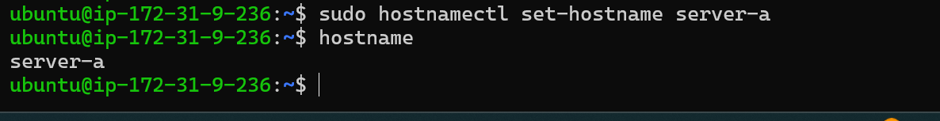
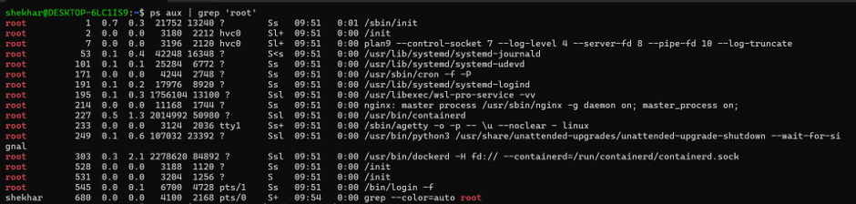

# Linux Practice – Processes and Services

## Hostname Commands

### 1. View Current Hostname and Change Hostname

`hostnamectl` - Displays detailed hostname and system information.

`sudo hostnamectl set-hostname server-a` - Changes the system hostname.

---

## Process Commands

### 2. View Running Processes

`ps aux` — Displays all running processes along with details such as user, PID, CPU, and memory usage.

### 3. Find High CPU Consuming Processes

`ps aux --sort=-%cpu | head` — Displays the processes using the highest CPU.

### 4. Filter Processes by User
` ps aux | grep ‘root’ ` — Filters the process list to show processes associated with the root user.

---

## Service Commands

### 5. List Running Services

`systemctl list-units --type=service --state=running` — Lists the systemd services that are currently running.

### 6. Check Nginx Service Status

`systemctl status nginx`  — Shows the current status and recent information about the Nginx service.

### 7. View nginx Service Dependencies

`systemctl list-dependencies nginx` — Displays the services and targets related to the Nginx service.

---

## Log Commands

### 8. View SSH Logs

`journalctl -u nginx` — Displays logs generated by the Nginx service.

---

## What I Learned Today

- Practiced checking and changing the hostname using `hostnamectl`.
- Learned how to inspect running processes using `ps`.
- Learned how to filter processes based on the user.
- Practiced managing and inspecting services using `systemctl`.
- Understood how to check Nginx status and its dependencies.
- Learned how to view service-specific logs using `journalctl`.
- Understood how process, service, and log checks can help during Linux troubleshooting.
